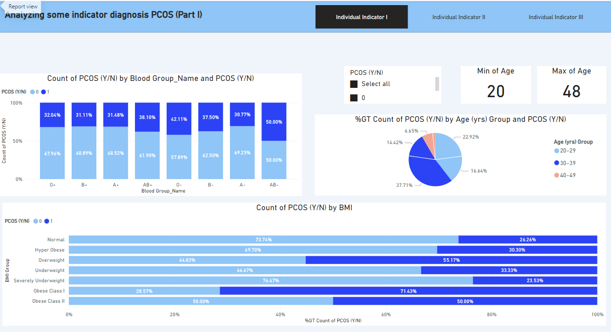
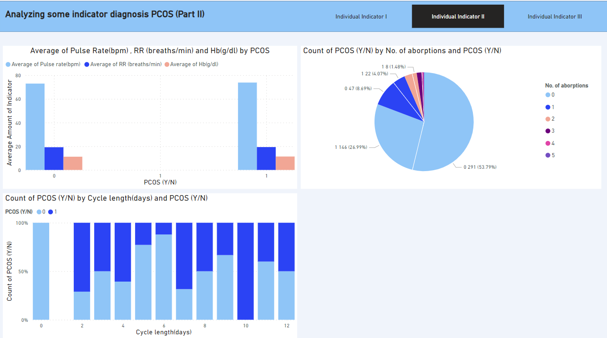
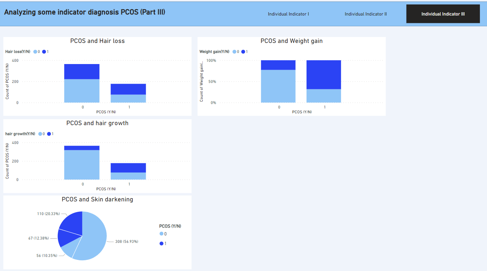

# PCOS diagnosis using Power BI & Python 💊🔬💉🩸🩺

### Welcome to my data analysis journey using Power BI & Python! 📊📈📉

As a data analysis instructor seeking practical experience with real-world scenarios, I've curated this example (and many more to come) to showcase the application of Power BI.

### Overview 

- **Import data:**
- Load are two diffrent file: 1. PCOS_data_without_infertility.xlsx, 2. PCOS_infertility.csv
- Examine whether there is common data between the two tables. Since there isn't any common data, we've decided to proceed and analysis using only the 'PCOS_data_without_infertility.xlsx' table."

- **Preprocessing data:** 📉
- Filling missing value:
  Modifying some of the records in columns "Fast food (Y/N)" and "Marraige Status (Yrs)"

- Control data type:
  Change the data type of columns "AMH(ng/mL)" and "II    beta-HCG(mIU/mL)" from string to numeric

- Clean column name:
  Remove leading and trailing whitespace from columns name

- **Analysing data:** 
- For this investigation, modify data types, create new columns such as "Blood Group", "Age Group", "BMI Group"
- Create a heat map for understanding corrolations
- Investigating individual indicators (Blood Group, Age, Weight, Height,BMI, Cycle length, Follicle No. (R), Follicle No. (L), Hb(g/dl), Endometrium (mm) ) and their relationship with the PCOS

### Images of the dashboard

### Common terms in this business 📖
- **PCOS:** Polycystic Ovary Syndrome
- **BMI:**Body mass index
- **Cycle(R/I)**: Show regular (R) and irregular (I) Cycle
- **Hb(g/dl)**: Refers to the measurement of hemoglobin concentration in blood, expressed in grams per deciliter (g/dL)

